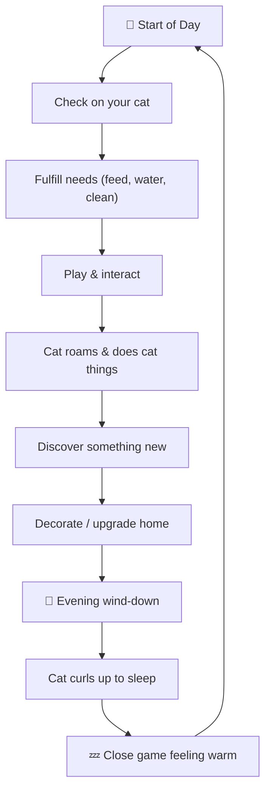

# 🐱 CatRaising — Game Design Plan

> *A cozy, heartwarming 2D cat companion game where every purr feels like a hug.*

---

## 🎯 Game Vision

**One-liner:** A pixel-art virtual pet game where you adopt, nurture, and build a lifelong bond with your cat in a warm, living home.

**Pillars:**
1. **Cozy** — Soft colors, gentle animations, lo-fi music. No stress, no fail states, no timers pressuring you.
2. **Heartwarming** — The cat remembers you. It develops personality quirks. It greets you when you come back. It sleeps in the spot you pet it last.
3. **Chill** — Play for 5 minutes or 5 hours. The game rewards presence, not grind.

**Target Feel:** *Stardew Valley's coziness × Neko Atsume's simplicity × Tamagotchi's attachment*

---

## 📦 Existing Assets

| Asset | Description |
|---|---|
| Walking sprite sheet | 33-frame tuxedo cat walk cycle (4 columns × 8+ rows) |
| Sitting sprite | Cat sitting upright, front-facing — used for idle/alert state |
| Lying down sprite | Cat loafing/resting — used for sleep/relaxed state |

**Art Style:** Pixel art, black & white tuxedo cat with green eyes and pink nose. Charming and expressive.

---

## 🔄 Core Gameplay Loop

The game follows a **daily rhythm loop** — mirroring how real cat ownership feels:



### The Micro-Loop (moment-to-moment, 30 seconds)
- See cat doing something cute → interact → get rewarded with purring/affection animation → feel good

### The Session Loop (5-20 minutes)
- Open game → check needs → feed/play → discover new behavior or unlock → close game satisfied

### The Macro-Loop (days/weeks)
- Bond deepens → cat unlocks new behaviors → you unlock new rooms/items → seasonal events surprise you → your home becomes *yours*

---

## 🧠 Core Systems

### 1. 🐾 Cat Needs System

Four gentle needs that decay slowly — **never punishing**, just inviting you back:

| Need | Decay Rate | Effect When Low | Effect When Full |
|---|---|---|---|
| **Hunger** 🍖 | ~4 hours real-time | Cat meows at food bowl, looks grumpy | Happy purring, energetic |
| **Thirst** 💧 | ~3 hours real-time | Cat sits by water dish | Playful, active |
| **Happiness** 💛 | ~6 hours real-time | Cat naps more, less interactive | Zooms around, plays with toys |
| **Cleanliness** 🧹 | ~8 hours real-time | Cat grooms itself frequently | Shiny coat animation |

> [!IMPORTANT]
> **No death. No punishment.** If you forget for days, the cat is just sleepy and a bit grumpy. It perks right back up when you return. A message like *"Oh! You're back! I missed you..."* appears with a slow tail wag.

### 2. 💕 Affection & Bond System

The emotional core of the game. Your bond with the cat grows through consistent care and interaction.

**Bond Level** (0–100, displayed as a heart meter):
| Level | Name | Unlocks |
|---|---|---|
| 0–10 | Stranger | Cat is skittish, hides, slow to approach |
| 11–25 | Acquaintance | Cat sits nearby, accepts food |
| 26–50 | Friend | Cat comes when called, plays with toys |
| 51–75 | Companion | Cat follows you, headbutts, slow blinks |
| 76–90 | Best Friend | Cat sleeps on your cursor, brings you "gifts" |
| 91–100 | Soulmate | Special animations, the cat purrs just being near you |

**Bond grows from:** Petting, feeding on time, playing, being present, discovering cat's preferences.
**Bond decays:** Very slowly when absent. Never drops below the last milestone (so you never lose major progress).

### 3. 🎮 Interaction System

Direct touch/click interactions with the cat:

| Interaction | Input | Cat Response |
|---|---|---|
| **Pet** | Click & hold on cat | Purring animation, hearts float up, eyes close |
| **Chin scratch** | Click under chin area | Cat tilts head up, happy squint |
| **Belly rub** | Click belly (risky!) | 70% happy wiggle, 30% playful bite (personality-dependent) |
| **Call** | Click anywhere + whistle button | Cat looks toward cursor, may come over (bond-dependent) |
| **Pickup** | Click & drag up | Cat dangles adorably (only at high bond) |
| **Toss toy** | Click & drag toy | Cat chases, pounces, brings it back sometimes |

### 4. 🧬 Cat Personality System

Your cat develops a personality based on how you interact with it — making every player's cat unique:

**Personality Traits** (each on a spectrum):
- **Playful ↔ Lazy** — Affects how often cat initiates play vs. naps
- **Affectionate ↔ Independent** — Affects how clingy the cat is
- **Brave ↔ Shy** — Affects reaction to new items/rooms
- **Curious ↔ Cautious** — Affects how quickly cat investigates new things
- **Vocal ↔ Quiet** — Affects frequency of meowing

Personality develops in the first few in-game weeks based on player behavior, then stabilizes with occasional drift. This creates **attachment** — *your* cat feels different from anyone else's.

---

## 🏠 The Home — Room System

The game takes place inside a cozy home. You start with one room and unlock more.

### Rooms (unlocked progressively)

| Room | Unlock Condition | Purpose |
|---|---|---|
| **Living Room** | Start | Main hangout, couch, window |
| **Kitchen** | Day 3 | Food & water bowls, cooking mini-game |
| **Bedroom** | Bond level 25 | Cat bed, wardrobe, nighttime events |
| **Garden/Balcony** | Bond level 50 | Outdoor exploration, butterflies, birds watching |
| **Attic** | Bond level 75 | Mystery boxes, hidden collectibles |
| **Cat Room** | Special unlock | Cat tree, tunnel, maximum play zone |

### Room Navigation
- Tap arrows on screen edges to move between rooms
- Cat can wander between unlocked rooms on its own
- Each room has interactive hotspots

---

## 🎨 Decoration & Customization

A huge part of the cozy factor — making the space *yours*:

### Furniture & Items
- **Cat furniture:** Cat tree, scratching posts, window perches, heated beds, tunnels
- **Home furniture:** Couch, bookshelf, plants, lamps, rugs, curtains
- **Cat toys:** Feather wand, laser pointer, yarn ball, paper bag, cardboard box
- **Seasonal decor:** Cherry blossoms, autumn leaves, snowflakes, fairy lights

### Item Interactions
Every item isn't just decorative — the cat interacts with them:
- Place a cardboard box → cat sits in it immediately (because *of course*)
- Place a bookshelf → cat knocks things off it
- Place a plant → cat nibbles it (safe plants only!)
- Place a bag → cat crawls inside
- Window perch → cat watches birds, chatters at them

### Currency: **Paw Coins** 🪙
- Earned by: Daily login, completing small tasks, achievements, finding hidden items
- Spent on: Furniture, toys, decorations, food varieties
- **Never purchasable with real money** — this is a cozy game, not a monetization machine

---

## 🌤️ Day/Night & Weather Cycle

Time passes gently, affecting mood and visuals:

| Time | Visuals | Cat Behavior |
|---|---|---|
| **Morning** | Warm golden light, birds chirping | Cat stretches, yawns, ready to play |
| **Afternoon** | Bright, sun patches on floor | Cat naps in sunbeam, peak play time |
| **Evening** | Orange sunset through windows | Cat gets cuddly, slower movement |
| **Night** | Blue moonlight, warm lamplight | Cat curls up, purring, sleepy |

### Weather (cosmetic + minor behavior changes)
- ☀️ **Sunny** — Cat finds sun patches
- 🌧️ **Rainy** — Cat watches raindrops on window, cozy indoor vibes, rain sounds
- ❄️ **Snowy** — Cat paws at window, you can put out a mini heated blanket
- 🌸 **Cherry Blossom** (Spring) — Petals float past windows

**Time sync option:** Can sync with real-world time or use accelerated in-game time (1 real minute = 1 in-game hour).

---

## 🎮 Mini-Games & Activities

Short, satisfying activities to break up the routine:

### 1. 🎣 Fishing Rod Toy
- Drag a feather toy around the screen
- Cat tracks and pounces
- Score based on how many "catches" in 30 seconds
- Reward: Happiness boost + Paw Coins

### 2. 🔴 Laser Pointer
- Tap to place a red dot
- Cat zooms toward it
- Create patterns for bonus points
- The dot is always *just* out of reach (realistic!)

### 3. 📦 Mystery Box
- Occasionally a package arrives at the door
- Open it to find random items (toys, decor, treats)
- Cat investigates the box itself for 10 minutes after

### 4. 🧶 Yarn Untangle
- Simple puzzle: untangle yarn lines
- Cat "helps" by batting at yarn (adorably unhelpful)
- Reward: New yarn color for cat to play with

### 5. 🍳 Cooking for Cat
- Simple cooking mini-game
- Combine ingredients to make cat meals
- Different recipes unlock as you progress
- Cat has favorite foods (personality-dependent)

### 6. 📸 Photo Mode
- Take photos of your cat in cute moments
- Scrapbook/album to collect them
- Special "rare moment" photos (first time in box, first zoomies, sleeping upside down)

---

## 📅 Seasonal Events & Surprises

Keep the game fresh with rotating content:

| Season | Event | Special Content |
|---|---|---|
| **Spring** 🌸 | Cherry Blossom Festival | Sakura decor, butterfly chasing, flower crown for cat |
| **Summer** ☀️ | Beach Day | Sandbox toy, seashell collection, sunhat for cat |
| **Autumn** 🍂 | Harvest Moon | Pumpkin items, cozy blankets, leaf pile to jump in |
| **Winter** ❄️ | Cozy Holidays | Fairy lights, gift exchange, tiny sweater for cat |

### Random Events (keep you delighted)
- Cat brings you a "gift" (a drawn mouse, a leaf, a sock)
- Cat does the *midnight zoomies*
- Cat discovers its reflection and gets confused
- Cat claims a new nap spot you didn't expect
- Stray cat visits the window (potential friend?)

---

## 🪝 Engagement & "Addiction" (The Healthy Kind)

The game should make players *want* to come back without manipulation. Here's how:

### 1. **Emotional Attachment**
- The cat feels *alive*. It has moods, preferences, quirks, a name you chose.
- You see it grow and change. That's powerful.
- The "welcome back" animation after being away hits different.

### 2. **Gentle FOMO (Fear of Missing Out)**
- Seasonal events have exclusive decor (but they come back yearly — no true scarcity)
- Random events are delightful surprises you don't want to miss
- The cat might be doing something cute *right now*

### 3. **Collection Completionism**
- Photo album to fill
- Furniture catalog (gotta catch 'em all)
- Achievement badges ("1000 pets!", "Cat sat in every box", "Survived a belly rub")
- Cat behavior catalog — discover all unique behaviors

### 4. **Routine Comfort**
- Like real cat ownership, the *routine* becomes the reward
- Morning: feed cat. Day: play. Night: watch cat sleep.
- The predictability is soothing, not boring

### 5. **Progressive Revelation**
- New behaviors unlock gradually (cat does something new at bond level 30, 50, 75...)
- New rooms to explore
- New items in the shop each week
- The game slowly reveals depth over weeks, not hours

### 6. **Social Sharing**
- Screenshot/share your cat's cutest moments
- Compare cat personalities with friends ("My cat? Total gremlin. Yours? A prince.")
- Optional: visit friends' cats

> [!TIP]
> **The key insight:** The "addiction" isn't dopamine-hit manipulation — it's the same reason people check on their real cats. You care about this little creature. That's the magic.

---

## 🎨 Art Direction

### Visual Style
- **Pixel art** — consistent with existing sprites (charming, nostalgic, warm)
- **Color palette:** Warm, muted tones — creams, soft browns, dusty pinks, sage greens
- **UI:** Rounded corners, soft shadows, hand-drawn feel
- **Particles:** Hearts, sparkles, zzz's, music notes, paw prints

### Key Art Needs (by priority)

| Priority | Asset | Description |
|---|---|---|
| 🔴 P0 | Room backgrounds | Living room, kitchen, bedroom (pixel art interiors) |
| 🔴 P0 | UI elements | Buttons, meters, menus, icons |
| 🔴 P0 | Food/water sprites | Bowl, fish, milk, kibble |
| 🟡 P1 | Furniture sprites | Cat tree, couch, bed, plants, lamps |
| 🟡 P1 | Toy sprites | Feather, yarn, laser dot, box |
| 🟡 P1 | Cat emotion sprites | Happy, sleepy, grumpy, playful, scared expressions |
| 🟢 P2 | Weather/lighting overlays | Sun patches, rain on window, snow |
| 🟢 P2 | Seasonal decor | Per-season decoration sets |
| 🟢 P2 | Additional cat animations | Eating, drinking, grooming, zoomies, scratching |

---

## 🔊 Audio Design

Audio is **critical** for cozy games. It's 50% of the vibe.

### Music
- **Lo-fi / acoustic guitar** ambient tracks
- Context-sensitive: cheerful morning, mellow afternoon, gentle night
- Music box version for sleep time
- Volume fades based on activity (quieter when cat sleeps)

### Sound Effects
| Sound | When |
|---|---|
| Soft purring | Petting, high happiness |
| Gentle meow (varied) | Cat wants attention, greeting |
| Food crunch | Eating |
| Water lap | Drinking |
| Toy jingle | Playing with toy |
| Rain patter | Rainy weather |
| Fire crackle | If fireplace placed |
| Page turn | Opening menus |
| Coin chime | Earning Paw Coins |
| Heartbeat (subtle) | During tender moments |

---

## 🏗️ Technical Architecture

### Unity Project Structure

```
Assets/
├── Source/
│   └── Images/              ← existing sprites
├── Scripts/
│   ├── Core/
│   │   ├── GameManager.cs          — Game state, save/load, time
│   │   ├── TimeManager.cs          — Day/night cycle, weather
│   │   └── SaveSystem.cs           — JSON-based save/load
│   ├── Cat/
│   │   ├── CatController.cs        — Main cat behavior FSM
│   │   ├── CatNeeds.cs             — Hunger, thirst, happiness, cleanliness
│   │   ├── CatPersonality.cs       — Trait system
│   │   ├── CatAnimator.cs          — Animation state management
│   │   ├── CatInteraction.cs       — Click/touch response handling
│   │   └── CatAI.cs                — Autonomous behavior (wander, nap, play)
│   ├── Home/
│   │   ├── RoomManager.cs          — Room switching, unlocking
│   │   ├── FurnitureSystem.cs      — Place/move/remove furniture
│   │   └── InteractableItem.cs     — Base class for interactive objects
│   ├── UI/
│   │   ├── HUDManager.cs           — Need bars, bond meter, coins
│   │   ├── ShopUI.cs               — Buy items/food
│   │   ├── InventoryUI.cs          — Player's items
│   │   ├── PhotoAlbumUI.cs         — Collected photos
│   │   └── SettingsUI.cs           — Volume, time sync, etc.
│   ├── MiniGames/
│   │   ├── FishingToyGame.cs       — Feather wand mini-game
│   │   ├── LaserPointerGame.cs     — Laser pointer mini-game
│   │   └── CookingGame.cs          — Meal prep mini-game
│   └── Data/
│       ├── FurnitureDatabase.cs    — ScriptableObject catalog
│       ├── FoodDatabase.cs         — ScriptableObject catalog
│       └── AchievementDatabase.cs  — Achievement definitions
├── Prefabs/
│   ├── Cat/
│   ├── Furniture/
│   ├── UI/
│   └── Effects/
├── Sprites/
│   ├── Cat/
│   ├── Rooms/
│   ├── Furniture/
│   ├── Items/
│   ├── UI/
│   └── Effects/
├── Audio/
│   ├── Music/
│   └── SFX/
├── Animations/
│   ├── Cat/
│   └── UI/
├── ScriptableObjects/
│   ├── Furniture/
│   ├── Food/
│   └── Achievements/
└── Scenes/
    ├── MainMenu.unity
    ├── Game.unity
    └── Loading.unity
```

### Key Technical Decisions

| Decision | Choice | Rationale |
|---|---|---|
| **Cat AI** | Finite State Machine (FSM) | Simple, debuggable, perfect for pet behavior patterns |
| **Save System** | JSON + PlayerPrefs | Simple, portable, no server needed |
| **UI Framework** | Unity UI (uGUI) | Already included, sufficient for 2D game |
| **Animation** | Unity Animator + sprite swaps | Leverages existing sprite sheet setup |
| **Input** | Unity Input System (new) | Already in project, supports touch + mouse |
| **Rendering** | URP 2D | Already configured, good lighting for day/night |
| **Time** | Real-time with offline catch-up | Calculates need decay while game was closed |

---

## 🗓️ Development Roadmap

### 🏁 Milestone 1: Playable Prototype (Week 1-2)
> *Goal: A cat that walks, sits, lies down, and responds to petting*

- [ ] Set up proper sprite sheet slicing for walk animation
- [ ] Create `CatController` FSM (Idle → Walking → Sitting → Sleeping)
- [ ] Implement basic click-to-pet interaction (hearts particle effect)
- [ ] Cat wanders autonomously between random points
- [ ] Basic room background (living room)
- [ ] Simple HUD (bond meter, need bars)

### 🏁 Milestone 2: Core Loop (Week 3-4)
> *Goal: Feed, water, play with, and bond with your cat*

- [ ] Cat needs system (hunger, thirst, happiness, cleanliness)
- [ ] Food and water bowl interactables
- [ ] Simple toy interaction (drag feather wand)
- [ ] Bond system with visible progression
- [ ] Day/night cycle (visual lighting changes)
- [ ] Basic save/load system

### 🏁 Milestone 3: Home & Decoration (Week 5-6)
> *Goal: Multiple rooms, furniture placement, shop*

- [ ] Room system (living room + kitchen + bedroom)
- [ ] Furniture placement grid
- [ ] Shop UI with Paw Coin economy
- [ ] 10-15 furniture items with cat interaction behaviors
- [ ] Paw Coin earning (daily tasks, achievements)

### 🏁 Milestone 4: Personality & Depth (Week 7-8)
> *Goal: Cat feels alive and unique*

- [ ] Personality trait system
- [ ] Cat preference system (favorite food, toy, nap spot)
- [ ] Additional cat animations (eating, drinking, grooming, playing)
- [ ] Random events system
- [ ] Achievement system
- [ ] Photo mode

### 🏁 Milestone 5: Polish & Content (Week 9-10)
> *Goal: Ship-quality experience*

- [ ] Audio (music + all SFX)
- [ ] Weather system
- [ ] Seasonal event framework + 1 seasonal event
- [ ] Mini-games (fishing toy, laser pointer)
- [ ] Garden/balcony room
- [ ] Tutorial / first-time user experience
- [ ] Main menu + settings

### 🏁 Milestone 6: Final Polish (Week 11-12)
> *Goal: Complete, tested, delightful*

- [ ] All particle effects and juice
- [ ] Screen transitions
- [ ] Edge case handling (long absence, first launch)
- [ ] Performance optimization
- [ ] Playtesting and balance tuning
- [ ] Build for target platform(s)

---

## ❓ Open Questions for You

> [!IMPORTANT]
> Please review these questions so I can tailor the implementation:

1. **Target Platform:** PC only? Mobile? Both? (This affects input design, screen layout, and performance targets significantly)

2. **Scope Priority:** This plan is ambitious. Would you like to:
   - **(A)** Build the full vision over months
   - **(B)** Focus on a tight MVP first (Milestones 1-2), then iterate
   - **(C)** Something in between — pick specific features that excite you most

3. **Art Pipeline:** For the additional sprites/art needed (room backgrounds, furniture, UI), would you:
   - Create them yourself in the same pixel art style?
   - Want me to generate placeholder art with the image generation tool?
   - Use asset packs?

4. **Time System Preference:** 
   - **Real-time sync** (game clock = real clock, cat is sleeping at night IRL)  
   - **Accelerated time** (1 real minute = 1 game hour, full day in 24 minutes)
   - **Player choice** between both?

5. **Name the Cat:** Does the tuxedo cat already have a name? Should the player name them at the start?

6. **Monetization:** Is this purely a passion/portfolio project, or do you plan to release it commercially? (Affects how I handle economy balance and optional features)

---

## ✅ Verification Plan

### Automated Tests
- Unit tests for `CatNeeds` decay calculations
- Unit tests for `CatPersonality` trait evolution
- Unit tests for `SaveSystem` serialization/deserialization
- Integration tests for FSM state transitions

### Manual Verification
- Play through each milestone's features in Unity Editor
- Verify sprite animations look correct at intended frame rates
- Test save/load across sessions
- Test day/night visual transitions
- Playtest core loop for "feel" — does petting feel good? Is feeding satisfying?

### Browser/Build Testing
- Test on target platform builds
- Verify performance (target: 60fps steady)
- Test offline time calculation accuracy
